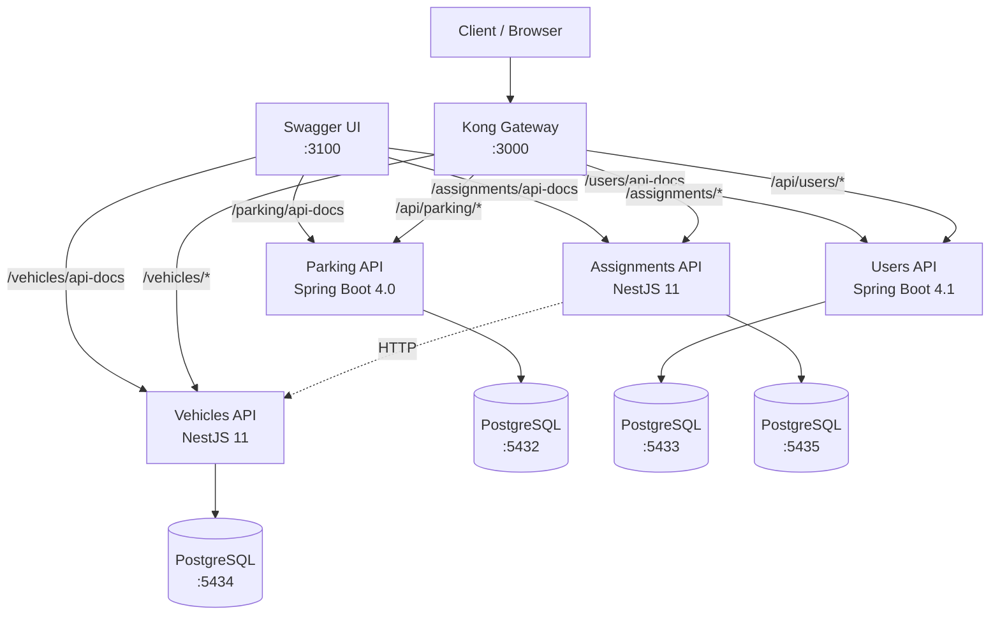

# Parking Reservation System


Distributed parking reservation system built with a microservices architecture, unified behind Kong API Gateway.

## Architecture



## Services

| Service | Tech | Port (internal) | DB Port | Description |
|---------|------|----------------|---------|-------------|
| **Parking** | Spring Boot 4.0.6 | 8080 | 5432 | Zones and spaces management |
| **Users** | Spring Boot 4.1.0 | 8081 | 5433 | Persons, users, roles |
| **Vehicles** | NestJS 11 | 3000 | 5434 | Vehicle registry (cars, motorcycles, trucks) |
| **Assignments** | NestJS 11 | 3000 | 5435 | Vehicle-owner assignment & audit trail |
| **Swagger UI** | swagger-api/swagger-ui | 8080 | — | Unified API docs at `:3100` |
| **Kong** | kong:3.9 | 8000/8443 | — | API Gateway at `localhost:3000` |

## Quick Start

```bash
# Clone and start everything
docker compose up -d --build

# The APIs are available through Kong:
#   http://localhost:3000/api/parking/...
#   http://localhost:3000/api/users/...
#   http://localhost:3000/vehicles/...
#   http://localhost:3000/assignments/...

# Unified Swagger UI:
#   http://localhost:3100
```

## Documentation

### Parking (zones & spaces)

| Document | Description |
|----------|-------------|
| [Requirements](docs/parking/requirements.md) | Functional requirements and business rules |
| [Data Model](docs/parking/data-model.md) | ER diagram, entities, and enums |
| [API Reference](docs/parking/api-reference.md) | Endpoints, request/response examples |
| [Configuration](docs/parking/config.md) | Database setup and project config |

### Users (persons, users & roles)

| Document | Description |
|----------|-------------|
| [Requirements](docs/users/requirements.md) | Functional requirements and business rules |
| [Data Model](docs/users/data-model.md) | ER diagram, entities, and enums |
| [API Reference](docs/users/api-reference.md) | Endpoints, request/response examples |
| [Configuration](docs/users/config.md) | Database setup and project config |

### Vehicles

| Document | Description |
|----------|-------------|
| [Requirements](docs/vehicles/requirements.md) | Functional requirements and business rules |
| [Data Model](docs/vehicles/data-model.md) | ER diagram, entities, and enums |
| [API Reference](docs/vehicles/api-reference.md) | Endpoints, request/response examples |
| [Configuration](docs/vehicles/config.md) | Database setup and project config |

### Assignments

| Document | Description |
|----------|-------------|
| [Requirements](docs/assignments/requirements.md) | Functional requirements and business rules |
| [Data Model](docs/assignments/data-model.md) | ER diagram, entities, and enums |
| [API Reference](docs/assignments/api-reference.md) | Endpoints, request/response examples |
| [Configuration](docs/assignments/config.md) | Database setup and project config |

## Project Structure

```
├── parking/              # Spring Boot — zones & spaces
├── users/                # Spring Boot — persons, users, roles
├── vehicles/             # NestJS — vehicle registry
├── assignments/          # NestJS — assignments & audit
├── docs/                 # Documentation per service
│   ├── parking/
│   ├── users/
│   ├── vehicles/
│   └── assignments/
├── kong.yml              # Kong declarative config (DB-less)
└── docker-compose.yml    # All services, databases, gateway
```
