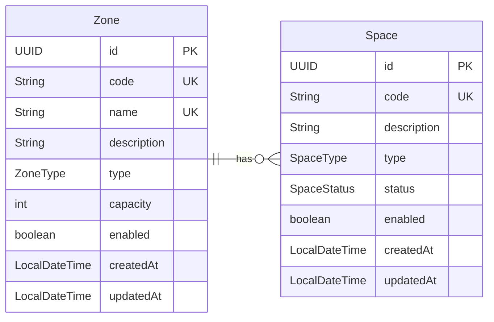

# Parking Reservation System


RESTful API for managing parking zones and spaces.

## Prerequisites

- Java 21+
- Maven 3.9+
- PostgreSQL 16+

## Getting Started

### 1. Clone the repository

```bash
git clone <repo-url>
cd reservas-espe
```

### 2. Configure the database

Create a PostgreSQL database:

```bash
psql -U postgres -c "CREATE DATABASE parking;"
```

### 3. Configure credentials

Edit `parking/src/main/resources/application.properties`:

```properties
spring.datasource.url=jdbc:postgresql://localhost:5432/parking
spring.datasource.username=postgres
spring.datasource.password=your_password
```

### 4. Build and run

```bash
cd parking
mvn spring-boot:run
```

Hibernate will automatically create the tables (`ddl-auto=update`).

## API Reference

Base URL: `http://localhost:8080/api/v1`

### Zones

| Method | Endpoint | Description | Status |
|--------|----------|-------------|--------|
| `GET` | `/zones` | List all zones | 200 |
| `GET` | `/zones/{id}` | Get zone by ID | 200 |
| `POST` | `/zones` | Create a zone | 201 |
| `PUT` | `/zones/{id}` | Update a zone | 200 |
| `PATCH` | `/zones/{id}/status` | Toggle zone enabled/disabled | 204 |

#### Create Zone

```http
POST /api/v1/zones
Content-Type: application/json

{
    "name": "VIP Zone",
    "description": "Exclusive VIP parking",
    "type": "VIP",
    "capacity": 10
}
```

#### Update Zone

```http
PUT /api/v1/zones/{id}
Content-Type: application/json

{
    "name": "VIP Zone North",
    "description": "Updated VIP zone",
    "type": "VIP",
    "capacity": 15
}
```

### Spaces

| Method | Endpoint | Description | Status |
|--------|----------|-------------|--------|
| `GET` | `/spaces` | List all spaces | 200 |
| `GET` | `/spaces/{id}` | Get space by ID | 200 |
| `POST` | `/spaces` | Create a space | 201 |
| `PUT` | `/spaces/{id}` | Update a space | 200 |
| `PATCH` | `/spaces/{id}/status` | Toggle space enabled/disabled | 204 |
| `DELETE` | `/spaces/{id}` | Delete a space | 204 |

#### Create Space

```http
POST /api/v1/spaces
Content-Type: application/json

{
    "zoneId": "uuid-of-existing-zone",
    "description": "Space 1",
    "type": "CAR",
    "status": "AVAILABLE"
}
```

#### Update Space

```http
PUT /api/v1/spaces/{id}
Content-Type: application/json

{
    "zoneId": "uuid-of-same-zone",
    "description": "Updated space",
    "type": "BIKE",
    "status": "AVAILABLE"
}
```

> **Note:** The zone cannot be changed once a space is created.

### Enums

#### ZoneType
`VIP`, `REGULAR`, `INTERNAL`, `EXTERNAL`, `PREFERENTIAL`

#### SpaceType
`CAR`, `BIKE`, `TRUCK`

#### SpaceStatus
`AVAILABLE`, `OCCUPIED`, `RESERVED`, `MAINTENANCE`

## Data Model



### Business Rules

- **Zone creation**: Validates unique name, auto-generates code (`{TYPE}-{NN}`), sets enabled = true.
- **Zone update**: Cannot change type if it has associated spaces. Capacity cannot be less than current spaces count.
- **Zone toggle**: Cannot disable a zone with occupied spaces. Disabling/enabling propagates to all its spaces.
- **Space creation**: Validates zone existence and capacity. Auto-generates code (`{ZONE_TYPE}-{ZONE_NUM}-{NNN}`). Sets status = `AVAILABLE` and enabled = true.
- **Space update**: Cannot change the parent zone. Cannot occupy a disabled space.
- **Space toggle**: Cannot disable an occupied space. Cannot enable a space whose zone is disabled.
- **Space deletion**: Cannot delete an occupied space.

## Project Structure

```
parking/
├── src/main/java/ec/edu/espe/parking/
│   ├── controllers/       # REST controllers
│   ├── dtos/              # Request/Response DTOs
│   ├── entities/          # JPA entities
│   ├── mappers/           # Entity <-> DTO mappers
│   ├── repositories/      # Spring Data JPA repositories
│   ├── services/          # Business logic layer
│   │   └── impl/
│   └── ParkingApplication.java
├── src/main/resources/
│   ├── application.properties
│   ├── data.sql           # Seed data (manual execution)
│   └── trigger.sql        # DB trigger reference
└── pom.xml
```


