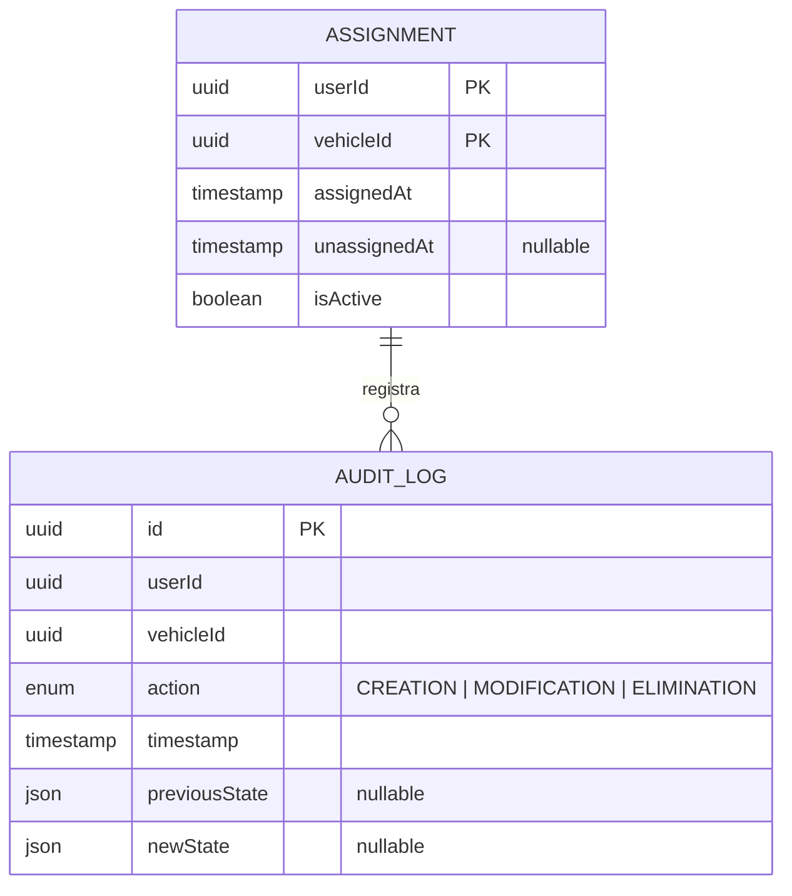

# Data Model

## Tables

### ASSIGNMENT

| Column | Type | Constraints |
|--------|------|-------------|
| `userId` | UUID | PK, not null |
| `vehicleId` | UUID | PK, not null |
| `assignedAt` | TIMESTAMP WITH TIME ZONE | Default `NOW()` |
| `unassignedAt` | TIMESTAMP WITH TIME ZONE | Nullable |
| `isActive` | BOOLEAN | Default `true` |

Composite primary key: (`userId`, `vehicleId`).

### AUDIT_LOG

| Column | Type | Constraints |
|--------|------|-------------|
| `id` | UUID | PK, auto-generated |
| `userId` | UUID | Not null |
| `vehicleId` | UUID | Not null |
| `action` | ENUM | `CREATION`, `MODIFICATION`, `ELIMINATION` |
| `timestamp` | TIMESTAMP WITH TIME ZONE | Default `NOW()` |
| `previousState` | JSONB | Nullable |
| `newState` | JSONB | Nullable |

## Enums

#### AuditAction
`CREATION`, `MODIFICATION`, `ELIMINATION`
