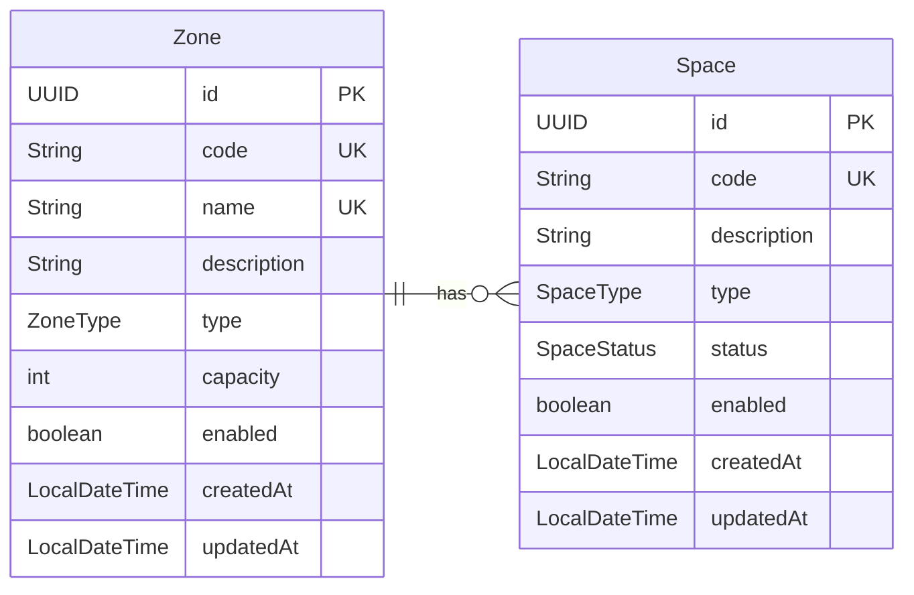

# Data Model

## Enums

#### ZoneType
`VIP`, `REGULAR`, `INTERNAL`, `EXTERNAL`, `PREFERENTIAL`

#### SpaceType
`CAR`, `BIKE`, `TRUCK`

#### SpaceStatus
`AVAILABLE`, `OCCUPIED`, `RESERVED`, `MAINTENANCE`
