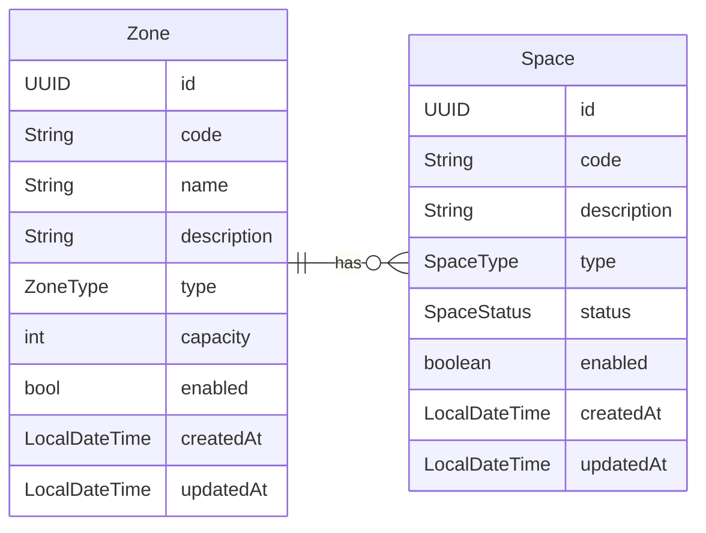

# Requerimientos

## Modelo de datos

## Requisitos Funcionales

### Zone

- RF-01 - Listar Zones
- RF-02 - Crear Zone (name, description, type, capacity)
  - Validación de name único
  - Generación de code
  - enabled = true
  - Actualización de createdAt y updatedAt
- RF-03 - Actualizar Zone (name, description, type, capacity)
  - Validación de name único
  - Validación en el cambio de capacity
  - Generación de code
  - Actualización de updatedAt
- RF-04 Cambiar enabled
  - Validar Spaces para la propagación en cascada
  - Propagar a Spaces en cascada
  - Actualización de updatedAt

### Space

- RF-05 - Listar Spaces
- RF-06 - Crear Space (zoneId, description, type)
  - Validación de existencia de zoneId
  - Validación de capacity de zone
  - Generación de code
  - status = AVAILABLE
  - enabled = true
  - Actualización de createdAt y updatedAt
- RF-07 - Actualizar Space (description, type, status)
  - Validar que la zone no cambie
  - Validación en el cambio de status
  - Actualización de updatedAt
- RF-08 - Cambiar enabled
  - Validar status
  - Validar enabled de zona
  - Actualización de updatedAt
- RF-09 - Eliminar Space