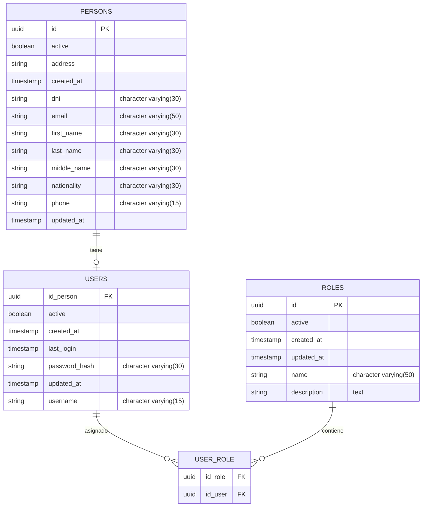

# Modelo de Datos

## Diagrama Entidad-Relación

## Descripción de Tablas

### PERSONS
Tabla que contiene información personal de los usuarios del sistema.

- **id_uuid**: Identificador único (UUID)
- **dni**: Documento de identidad
- **first_name, middle_name, last_name**: Nombre completo
- **email**: Correo electrónico
- **phone**: Teléfono de contacto
- **address**: Dirección
- **nationality**: Nacionalidad
- **active**: Estado de la persona
- **created_at, updated_at**: Auditoría temporal

### USERS
Tabla de credenciales y acceso al sistema.

- **id_person**: FK a PERSONS (relación uno a uno)
- **username**: Nombre de usuario único
- **password_hash**: Contraseña hasheada
- **active**: Usuario activo o inactivo
- **last_login**: Último acceso al sistema
- **created_at, updated_at**: Auditoría temporal

### ROLES
Tabla de roles disponibles en el sistema.

- **id**: Identificador único (UUID)
- **name**: Nombre del rol
- **description**: Descripción del rol
- **active**: Rol activo o inactivo
- **created_at, updated_at**: Auditoría temporal

### USER_ROLE
Tabla de relación muchos a muchos entre usuarios y roles.

- **id_user**: FK a USERS
- **id_role**: FK a ROLES

Permite asignar múltiples roles a cada usuario.

## Relaciones

1. **PERSONS → USERS** (1:1): Una persona puede tener una cuenta de usuario
2. **USERS → USER_ROLE → ROLES** (M:N): Un usuario puede tener múltiples roles
