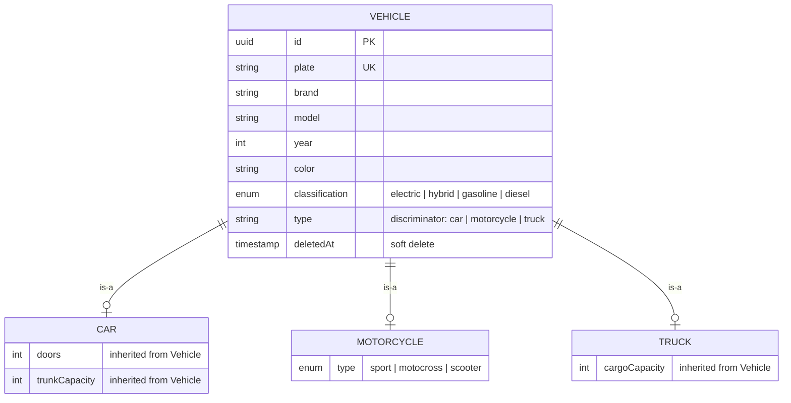

# Data Model

## Single Table Inheritance

All types share the `vehicle` table. The `type` column (lowercase) discriminates between `car`, `motorcycle`, and `truck`.

| Column | Type | Constraints |
|--------|------|-------------|
| `id` | UUID | PK, auto-generated |
| `plate` | VARCHAR | Unique, not null |
| `brand` | VARCHAR | Not null |
| `model` | VARCHAR | Not null |
| `year` | INTEGER | Not null |
| `color` | VARCHAR | Not null |
| `classification` | ENUM | `electric`, `hybrid`, `gasoline`, `diesel` |
| `type` | VARCHAR | Discriminator: `car`, `motorcycle`, `truck` |
| `doors` | INTEGER | Nullable (car only) |
| `trunkCapacity` | INTEGER | Nullable (car only) |
| `motorcycleType` | ENUM | Nullable (motorcycle only): `sport`, `motocross`, `scooter` |
| `cargoCapacity` | INTEGER | Nullable (truck only) |
| `deletedAt` | TIMESTAMP | Nullable, soft delete |

## Enums

#### Classification
`electric`, `hybrid`, `gasoline`, `diesel`

#### MotorcycleType (`type` on motorcycle)
`sport`, `motocross`, `scooter`
